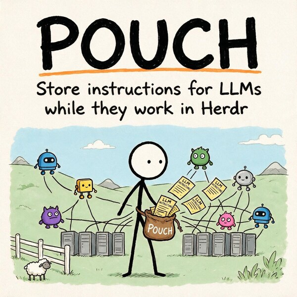

# Pouch

A [Herdr](https://herdr.dev) plugin for stashing prompts before an agent needs them, and inserting
them when it is ready.

Queue the next three instructions while the agent is still working, then hand them over one keypress
at a time. Text is **typed into the input, never submitted** — you always press Enter yourself.

```
┌ 1 👜 ┬ 2 ┬ + ─────────────────────────────────────────────────────────────┐
│ > implement the retry logic                                              │
```

- [Install](#install)
- [Use](#use)
- [Keybindings](#keybindings)
- [CLI](#cli)
- [Where things are stored](#where-things-are-stored)
- [Config](#config)
- [The strip](#the-strip-optional)
- [Runtime](#runtime)
- [Development](#development)
- [License](#license)

## Install

Needs **Node 22.6+ or [Bun](https://bun.sh)** — whichever you already have. Pouch runs its
TypeScript directly, so there is nothing to build and no binary to download.

```bash
git clone git@github.com:AltanS/herdr-pouch.git
cd herdr-pouch && ./bin/herdr-pouch setup
```

`setup` does the whole install and is safe to re-run:

1. links the plugin into Herdr (`herdr plugin link`),
2. puts `herdr-pouch` in `~/.local/bin`,
3. adds the three [keybindings](#keybindings) to `~/.config/herdr/config.toml` — it skips any chord
   you already use and never overwrites your own bindings,
4. validates the result with `herdr config check` **before** touching your config, keeping the old
   file as `config.toml.pouch-backup`,
5. reloads the running server, so the keys work immediately.

Pass `--no-keys` to leave `config.toml` alone and bind the keys yourself. Already inside Herdr? The
same thing runs from the action palette as **Pouch: finish setup**.

Check it worked:

```bash
herdr-pouch add "run the tests"    # in any pane inside Herdr
```

The pane now wears a 👜, and `prefix+shift+O` opens the pouch. **Until a pouch holds a message,
Pouch shows nothing at all** — an empty pouch has no indicator, which is normal and not a sign the
plugin failed to load. `herdr plugin list` confirms it is enabled.

## Update

```bash
herdr plugin action invoke update --plugin herdr.pouch
```

or `herdr-pouch update` from a shell. One step: it advances the checkout and re-registers the plugin
with Herdr. The re-link matters — Herdr caches the action set at link time, so a release that adds an
action answers `plugin_action_not_found` until the plugin is linked again.

It handles both install shapes. A `git clone` + `herdr plugin link` checkout fast-forwards its
branch; a `herdr plugin install` checkout is detached and shallow, so it re-detaches onto the newest
release tag instead. A Herdr-managed checkout is deliberately **never** re-linked — that would
re-register it as `local`, after which Herdr refuses `herdr plugin install`, the only other way to
repair it.

A routine update stays inside the major it is on. Crossing one needs the separate consent:

```bash
herdr plugin action invoke update-major --plugin herdr.pouch    # or: herdr-pouch update --major
```

Installs older than 0.3.0 have no `update` action, so they take this one the long way:

```bash
cd <checkout> && git pull --ff-only && herdr plugin link "$PWD"
```

## Use

Stash from anywhere — a shell, a script, or one agent preparing work for another:

```bash
herdr-pouch add "run the full test suite and report only failures"
herdr-pouch add --pane w1:p3 "now write the changelog entry"
git log -1 --format=%B | herdr-pouch add --agent reviewer
```

A pane holding messages wears a 👜 on its top border (or on the tab label, when the pane is alone in
its tab and has no border). `prefix+shift+O` opens it:

| key | effect |
| --- | --- |
| `↑↓` / `jk` | move · `g`/`G` jump to ends |
| `1`–`9` | insert that slot and close |
| `enter` | insert the selected message and close |
| `space` / `i` | insert without closing — for queueing several |
| `/` | filter as you type; `enter` keeps it, `esc` clears it |
| `y` | copy to the clipboard (OSC 52) |
| `n` · `e` · `d` | new · edit · delete (`n` and `e` open the editor — see [`editor`](#config)) |
| `J` / `K` | reorder (clear the filter first) |
| `p` | switch pouch — picks from every pouch on disk, live agent or not |
| `I` | choose which pane inserts go to |
| `q` / `esc` | close |

Clicking a row selects it; clicking it again inserts.

A pouch outlives the pane it was filled for. When that agent is gone the pouch has no destination,
so it says so and `I` (or any insert) asks which pane to send to. `p`, `herdr-pouch browse` and the
**Pouch: browse all pouches** action are the way back in — nothing else can name a pouch whose pane
has been closed.

## Keybindings

Herdr binds **one chord after the prefix** — `prefix+p+o` style sequences are rejected by its
parser. **Never bind a chord Herdr already uses** — a plugin bind shadows the built-in action, and
the built-in stops working.
Check Herdr's own key list before you claim a chord. `herdr-pouch setup` writes these three, which
are free in Herdr's defaults:

| key | does |
| --- | --- |
| `prefix+shift+O` | open the pouch for the focused pane |
| `prefix+shift+I` | insert the top message |
| `prefix+shift+A` | write a new message in `$EDITOR` |

**Insert-and-submit ships unbound.** `prefix+shift+N` is Herdr's `new_workspace`, and no other free
chord was left, so pick your own key or invoke the action by name:
`herdr plugin action invoke insert-top-submit --plugin herdr.pouch`.

`setup` adds exactly this block. Write it by hand only if you ran `setup --no-keys`:

```toml
[[keys.command]]
key = "prefix+shift+o"
type = "plugin_action"
command = "herdr.pouch.open"
description = "Pouch: open"

[[keys.command]]
key = "prefix+shift+i"
type = "plugin_action"
command = "herdr.pouch.insert-top"
description = "Pouch: insert top"

[[keys.command]]
key = "prefix+shift+a"
type = "plugin_action"
command = "herdr.pouch.compose"
description = "Pouch: stash a message"
```

**A remote client kills all three.** Herdr applies the *foreground* client's keybindings to the whole
server, and a client attached with `herdr --remote` sends a profile that drops every
`[[keys.command]]` entry — Herdr's own chords keep working, so it reads as a broken plugin. Copying
the bindings to the connecting machine does not help; they are stripped there too. Attach with
`herdr --remote <host> --remote-keybindings server`, or reach the actions from the action menu.
`herdr plugin action invoke doctor --plugin herdr.pouch` says which case you are in.

Each resolves the focused pane from the action's invocation context, so a binding always acts on
whatever you are looking at. Inserting never removes a message unless `consumeOnInsert` says so —
submitting one unseen is no exception.

## CLI

```
herdr-pouch add [target] [text...]   stash a message (reads stdin when no text)
herdr-pouch list [target] [--all]    show a pouch, or every pouch with --all
herdr-pouch show <ref> [target]      print one message in full
herdr-pouch insert [ref] [target]    type it into the agent's input
                                     (no ref = the top message; --submit presses Enter;
                                      --to <pane> aims it at a different pane)
herdr-pouch rm <ref> [target]        remove a message
herdr-pouch clear [target]           empty the pouch
herdr-pouch strip|unstrip [target]   pin / remove the strip under the pane
herdr-pouch open [target]            open the popup
herdr-pouch browse                   open the picker over every saved pouch
herdr-pouch sync                     repaint the indicators
herdr-pouch setup [--no-keys]        install the plugin, the CLI and the keybindings
herdr-pouch key [target]             print the resolved pouch identity
```

**Targets** — `--here` (the calling pane, default) · `--pane w1:p3` · `--agent <name>` (a live agent
name, or a saved pouch label).
**Refs** — a 1-based slot number, a message id, or a unique text prefix.

## Where things are stored

| what | where |
| --- | --- |
| pouches | `~/.local/state/herdr/plugins/herdr.pouch/pouches/<key>.json` |
| pane-id aliases | `…/herdr.pouch/aliases.json` |
| tab marks, pinned strips | `…/herdr.pouch/tabmarks.json`, `strips.json` |
| last-seen workspace labels | `…/herdr.pouch/workspaces.json` |
| config | `~/.config/herdr/plugins/config/herdr.pouch/config.json` |

Both roots mirror what Herdr injects into plugin processes, so the plugin panes and a bare
`herdr-pouch` in your shell always read the same store. `POUCH_STATE_DIR` overrides the state root.

**A pouch is keyed by `(workspace label, cwd, agent)`** — not by pane id. Pane ids are never reused:
they change when a pane moves and are regenerated when the Herdr server restarts. Keying by identity
means the pouch you filled yesterday is still on the same agent this morning. The live pane id is
kept as an alias so lookups stay a single file read.

Renaming a workspace therefore re-keys every pouch in it. Pouch migrates them on the spot: it
remembers the label behind each workspace id in `workspaces.json`, so when Herdr reports a rename
(which names only the *new* label) the old key is still derivable and the pouches move with it.

One JSON file per pouch, holding the message list in order:

```json
{
  "key": "e6958a73e69b5e9a",
  "label": "myproject/claude",
  "workspace": "myproject",
  "cwd": "/home/you/code/myproject",
  "agent": "claude",
  "messages": [
    { "id": "v8fsd0", "text": "run the full test suite", "createdAt": 1786828116010, "uses": 0 }
  ]
}
```

Every write takes a lock and re-reads inside it, so the popup, the strip, the CLI and Herdr's event
hooks can never clobber each other. An emptied pouch deletes its file rather than leaving litter.

## Config

`~/.config/herdr/plugins/config/herdr.pouch/config.json`, all keys optional:

```json
{
  "consumeOnInsert": false,
  "focusAfterInsert": true,
  "maxChipWidth": 34,
  "pollMs": 500,
  "indicator": "👜",
  "editor": "builtin"
}
```

- `editor` — what `n` and `e` open. `"builtin"` (default) is Pouch's own text box: `ctrl-s` saves,
  `esc` cancels, `enter` starts a new line, and a click puts the cursor where you click. `"system"`
  uses `$VISUAL`/`$EDITOR`. Anything else is run as a command with the file appended, so
  `"nano -I"`, `"micro"` or `"vim -u NONE"` all work. `POUCH_EDITOR` overrides the file.
- `consumeOnInsert` — remove a message once it has been used.
- `focusAfterInsert` — move focus to the agent pane after inserting, so Enter submits straight away.
- `indicator` — the mark on the border or tab label. Presence is the signal, so it carries no
  number; include `{count}` (e.g. `"👜{count}"`) if you want one. The exact mark written is recorded
  per tab, so changing this cleans up the old one instead of stranding it.

The count is also exposed as a `$pouch` token for sidebar agent rows:

```toml
[ui.sidebar.agents]
rows = [["state_icon", "workspace", "tab", "$pouch"], ["agent"]]
```

## The strip (optional)

If you would rather see the messages at all times than press a key, pin a three-row ASCII strip
under a pane with `herdr-pouch strip` (or the **Pouch: pin strip under this pane** action):

```
 ╭──╮   [1] implement the retry logic   [2] then run the migration   + add
╭┴──┴╮
╰─▪▪─╯
```

Up to four messages show as pips inside the bag; beyond that it carries the count. Every
chip is clickable: click the pouch to open the popup, a chip to insert it, `+ add` to compose.
`1`–`9`, `n`, `l`, `r` and `q` work from the keyboard.

It costs rows, which is why it is not the default.

## Runtime

Pouch runs on **Bun if present, otherwise Node ≥ 22.6**, which executes TypeScript by stripping
types. `scripts/run.sh` picks one and passes `--experimental-strip-types` on the Node versions that
need it. Override with `POUCH_RUNTIME=node|bun`, or point `POUCH_NODE` / `POUCH_BUN` at a specific
binary.

Everything the two runtimes spell differently lives in `src/runtime.ts`; the rest of `src/` uses no
runtime-specific globals, and `erasableSyntaxOnly` in `tsconfig.json` keeps out the TypeScript
syntax that type-stripping cannot handle.

There is deliberately **no compiled binary**: `bun build --compile` embeds the whole Bun runtime, so
the executable is ~91 MB to deliver ~28 KB of code, times one per platform. Running the source is
smaller, simpler, and works on anything that already runs a coding agent.

## Development

```bash
bun install                              # or: npm install
bun x tsc --noEmit                       # the gate; strict, no test suite yet
POUCH_RUNTIME=node ./bin/herdr-pouch list  # exercise the other runtime
herdr plugin link "$PWD"                 # re-run after any manifest change
herdr plugin log list --plugin herdr.pouch
herdr plugin action invoke doctor --plugin herdr.pouch   # resolved paths → plugin log
./scripts/check-version.sh               # versions must agree before a release
```

Plugin panes run `scripts/run.sh <entrypoint>`, which picks a runtime and executes
`src/<entrypoint>.ts` — there is no build step. Herdr renders pane chrome in its client, so borders,
the tab bar and the sidebar cannot be read back over the API; plugin *pane content* can, by opening
an entrypoint as a `split` and reading it. See [`CLAUDE.md`](./CLAUDE.md) for the full working
agreement.

## License

[MIT](./LICENSE) © Altan Sarisin
